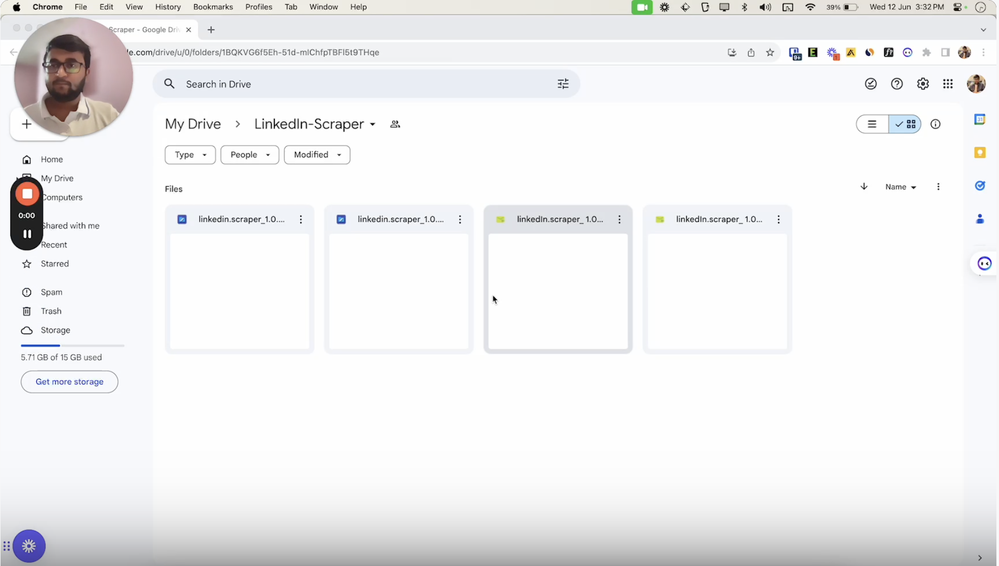

# Open Source LinkedIn Scraper

[](https://discord.gg/xJ272pHSt3)

## Features

- ✅ No official API access required. Just use a valid LinkedIn user account.
- ✅ Direct HTTP API interface. No Selenium, Pupeteer, or other browser-based scraping methods.
- ✅ Get people, companies, jobs, posts
- ✅ Export LinkedIn people searches
- ✅ Extract likes and comments data from the URL of any given post

> [!IMPORTANT]
> This library is not officially supported by LinkedIn. Using it might violate LinkedIn's Terms of Service. Use it at your own risk.


## Sponsors
> This is a sponsored section
<br/>
<a href="https://nubela.co/proxycurl?utm_campaign=influencer_marketing&utm_source=github&utm_medium=social&utm_content=pratik_dani_linkedin-scraper)">

</a>
<h3>
<a href="https://nubela.co/proxycurl?utm_campaign=influencer_marketing&utm_source=github&utm_medium=social&utm_content=pratik_dani_linkedin-scraper">
Proxycurl
</a>
</h3>
Scrape public LinkedIn profile data at scale with <a href="https://nubela.co/proxycurl?utm_campaign=influencer_marketing&utm_source=github&utm_medium=social&utm_content=pratik_dani_linkedin-scraper">
Proxycurl APIs</a>.

- Scraping Public profiles are battle tested in court in HiQ VS LinkedIn case.
- GDPR, CCPA, SOC2 compliant
- High rate limit - 300 requests/minute
- Fast - APIs respond in ~2s
- Fresh data - 88% of data is scraped real-time, other 12% are not older than 29 days
- High accuracy
- Tons of data points returned per profile

Built for developers, by developers.


# :construction: Under Active Development

## Installation

### Run locally

```
# For your system
$ npm run build

# For mac
$ npm run build:mac

# For mac universal
$ npm run build:mac:universal

# For windows32
$ npm run build:win32

# For windows64
$ npm run build:win64

# For linux
$ npm run build:linux
```

Then from the `dist` folder download the relevant installation file based on your operating system and install it.

### Download from the releases

Download LinkedIn Scraper from the [releases](https://github.com/devildani/LinkedIn-Scraper/releases)


## Usage

Video Tutorial and guide:
[](https://www.youtube.com/watch?v=oYSHsxLMCI8)

## Join Discord Community

[](https://discord.gg/xJ272pHSt3)

## Disclaimer

This library is not endorsed or supported by LinkedIn. It is an unofficial library intended for educational purposes and personal use only. By using this library, you agree to not hold the author or contributors responsible for any consequences resulting from its usage.
